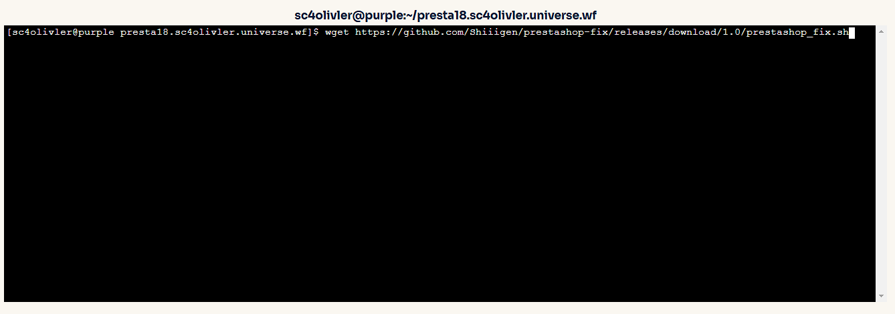
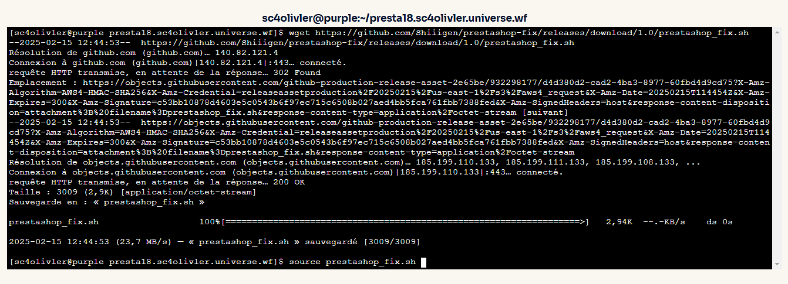

# Script Prestashop pour les versions 1.6.X jusqu'à 8.X

Suite à de nombreuses demandes de support, je mets donc à disposition un script permettant de réinjecter les fichiers core/natif de Prestashop dans le cas d'erreur 500 par exemple.

Attention, le script ne permet pas de corriger **TOUTES** les **ERREURS 500**.
Si suite à la réinjection, vous avez toujours des erreurs 500, c'est que le problème se situe autre part.

Je propose donc l'outil en l'état. Si suite à l'utilisation du script, vous avez effectué une erreur d'utilisation ou autre cas, malheureusement, **je ne pourrai rien faire de plus sur l'outil ni sur son utilisation**, donc si vous avez peur de faire une erreur d'utilisation, je vous conseille plutôt de mettre à jour la version de Prestashop de votre site directement par une version maintenu à jour et stable par [Prestashop](https://prestashop.fr/versions/)

## 1 / Prérequis

Avant de lancer le script, je vous conseille de suivre les recommandations suivantes :

    - FAIRE UNE SAUVEGARDE DE VOTRE SITE INTERNET
    - AVOIR ACCES AU TERMINAL CPANEL, si cela n'est pas le cas (par exemple sur une lune, vous pouvez contacter le support)

## 2 / Que fait le script ?

Le script va réinjecter les fichiers core/natif de Prestashop dans le cas où vous avez des erreurs 500 sur votre site.
En détail, il va effectuer les actions suivantes : 

    - Détection automatique de la version de Prestashop de votre site.
    - Télécharger le fichier zip de la version de Prestashop.
    - Dézipper le fichier.
    - Remplacer les fichiers core/natif de votre site par ceux de la version de Prestashop.
    - Supprimer les fichiers et dossiers inutiles (/admin /install).
    - Modifier les droits des fichiers et dossiers (chmod 755 pour les dossiers et 644 pour les fichiers).
    - Supprimer le fichier zip téléchargé.
    - Supprimer le script.

## 3 / Utilisation

Avant de lancer le script sur le Terminal, il vous faudra savoir le répertoire ou pointe le dossier de votre site, vous pouvez le savoir en vous rendant sur votre cPanel -> Domaine Configurés (pour le cas d'un domaine) ou alors depuis l'outil "Sous-Domaines" (pour le cas d'un sous-domaine) et la section qui vous intéresse est le champ "Racine du document" comme suivant :


Une fois que vous avez récupéré le répertoire, vous pouvez lancer le script en suivant les étapes suivantes :

    - Vous rendre sur votre cPanel
    - Ouvrir le Terminal de votre cPanel
    - Se rendre dans le répertoire de votre site (cd /home/votre_user/public_html/votre_site)

Et ensuite, il faudra lancer les commandes suivantes :

```bash
        - wget https://github.com/Shiiigen/prestashop-fix/releases/download/1.0/prestashop_fix.sh
        - source prestashop_fix.sh
```

Vous pouvez vous aider des captures d'écrans suivantes : 

En première commande, vous aurez celle-ci qui va télécharger le fichier depuis le repository :


En deuxième commande, vous aurez celle-ci qui va lancer le script :

Il vous faudra alors la lancer et laisser le script faire son travail.


